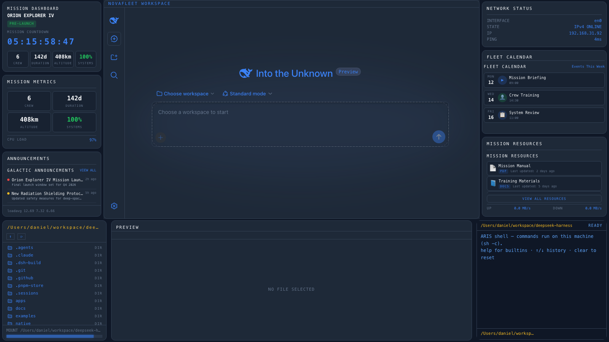

# dsh-edex-ui-novafleet

**DeepSeek Harness eDEX-UI shell plugin — NovaFleet Mission Control theme.** A
mission-control dashboard skin for the DSH web GUI, themed from the NovaFleet
space-fleet reference (dark navy `#0f1726` canvas, blue-gray `#1e2938` card
surface, bright blue `#3b82f6` accent, 1px `#334155` card borders with ~10px
radius, flat dashboard — no scanlines). Wraps the original UI with mission
telemetry, a fleet calendar, announcements, and a resources list.



## Features

- **Left bar** — NovaFleet mission dashboard:
  - **MISSION DASHBOARD** — countdown clock + PRE-LAUNCH status pill + stat
    tiles (Crew / Duration / Altitude / Systems)
  - **MISSION METRICS** — compact metric tile grid
  - **ANNOUNCEMENTS** — Galactic Announcements list with colored status dots
    (red / yellow / green)
- **Right bar**:
  - **NETWORK STATUS** — interface state readout
  - **FLEET CALENDAR** — featured widget (replaces the WORLD VIEW globe):
    weekly events calendar with day labels, event icons, and a View Full
    Calendar button
  - **MISSION RESOURCES** — resource list with file badges (PDF / DOCS / APP)
    and last-updated timestamps
- **Bottom panel** — one strip hosting three swappable widgets, each wrapped in
  the same title/border chrome:
  - **DIR** — filesystem browser as a terminal-style LIST (icon + name +
    DIR/FILE), the same width as the left bar, with storage bar
  - **PREVIEW** — file preview / editor pane (text, code, images), spanning
    the center region
  - **TERMINAL** — a real host shell: commands execute through the
    `systemMetrics.runCommand` Remote (`sh -c`, 30s timeout), with client-side
    `cd`/`clear`/`help`/`pwd`, ↑/↓ history, and a prompt that follows the
    filesystem browser until you run your first command
- **Mission-styled composer** — dark inset rounded input (1px `#334155` border,
  ~8px radius, inset shadow) mirroring the reference's search field, with a
  `~/<workspace>` path prompt at the left edge of the input area
- **Workspace-follow** — the dir panel and prompt track the active conversation's
  workspace folder
- **Center chrome** — the original DSH UI is framed as a NovaFleet widget card:
  a `NOVAFLEET WORKSPACE` title bar strip over a 1px `#334155` border card, the
  workspace background matching the shell panel surface (`#1e2938`)

## Reference

Web-discovered NovaFleet mission-control dashboard
(https://frontend-challange-five.vercel.app/), captured and analyzed with the
vision toolkit. See `analysis.json` / `analysis.md` for the full theme
breakdown.

## Install

```
pnpm dsh plugin --profile web add @danielng23/dsh-edex-novafleet-ui
```
